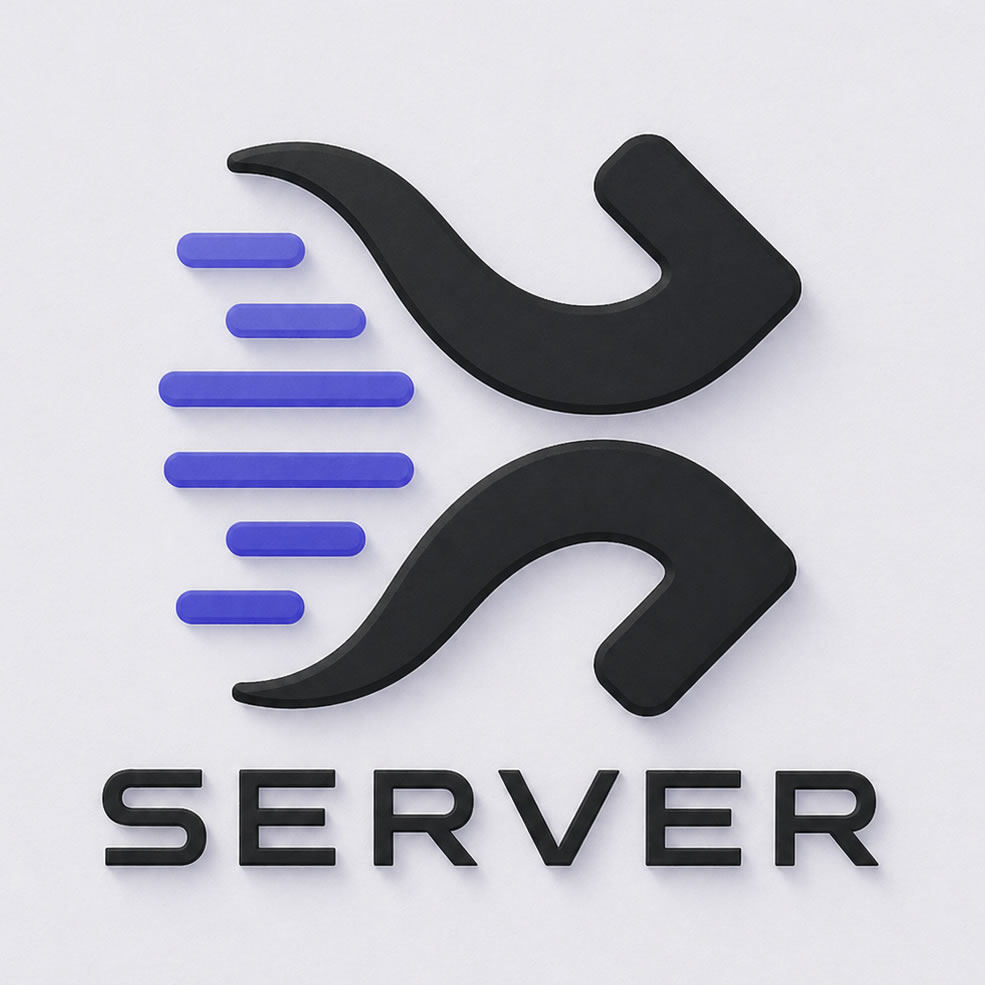

<p align="center">
  
</p>

<h1 align="center">TrueAsync Server</h1>

<p align="center">
  High-performance HTTP/1.1, HTTP/2, and HTTP/3 server as a native PHP extension,<br/>
  built on the <a href="https://github.com/true-async">TrueAsync</a> event loop.
</p>

<p align="center">
  <a href="LICENSE"></a>
  
  
  
  
  
  
  
</p>

---

TrueAsync Server is a native PHP extension that runs a high-performance web server **directly inside PHP** — no separate process, no reverse proxy, no external daemon.

The defining characteristic is **multi-protocol in a single server**: HTTP/1.1, HTTP/2, WebSocket, SSE, and gRPC share the same TCP port and the same event loop — protocol selection happens via **ALPN negotiation** (for TLS) or **HTTP Upgrade**. HTTP/3 runs on the same UDP port (QUIC), advertised to clients through an `Alt-Svc` response header, so they transparently upgrade on subsequent requests.

This means you can serve a REST API over HTTP/2, push real-time events over Server-Sent Events, handle long-lived connections over WebSocket, and expose a gRPC endpoint — all from a single `$server->start()` call.

---

## Features

| Status | Feature | Details |
|--------|---------|---------|
| ✅ Ready | **HTTP/1.1** | Full RFC 9112 compliance, keep-alive, pipelining |
| ✅ Ready | **TLS 1.2 / 1.3** | OpenSSL 3.x, ALPN negotiation |
| ✅ Ready | **Multipart / file uploads** | Streaming zero-copy parser |
| ✅ Ready | **Backpressure** | CoDel (RFC 8289) adaptive pausing |
| ✅ Ready | **Native coroutines** | Deep integration with TrueAsync async API |
| ✅ Ready | **Zero-copy architecture** | Minimal allocations on hot paths |
| ✅ Ready | **HTTP/2** | Multiplexing, server push (via nghttp2) |
| ✅ Ready | **HTTP/3 / QUIC** | UDP transport via ngtcp2 + nghttp3; OpenSSL 3.5 QUIC API |
| 📋 Planned | **WebSocket** | RFC 6455, upgrade from HTTP/1.1 and HTTP/2, full duplex |
| 📋 Planned | **SSE (Server-Sent Events)** | RFC 8895, server-to-client event streaming |
| 📋 Planned | **gRPC** | Built on HTTP/2, unary and streaming RPC |

### Development Progress

```
HTTP/1.1   ████████████████████  100%
TLS        ████████████████████  100%
HTTP/2     ████████████████████  100%
HTTP/3     ████████████████████  100%
WebSocket  ░░░░░░░░░░░░░░░░░░░░    0%
SSE        ░░░░░░░░░░░░░░░░░░░░    0%
gRPC       ░░░░░░░░░░░░░░░░░░░░    0%
```

All ten ship-gates of the HTTP/3 plan (transport, TLS 1.3, request/response, streaming, lifecycle + drain, Alt-Svc, compliance smoke, fuzzing) are merged. Open items are post-ship performance follow-ups — `recvmmsg` inbound batching and Linux GSO outbound coalescing — that require upstream TrueAsync API extensions, plus optional ECN/pacing.

---

## Architecture

TrueAsync Server follows the **single-threaded event loop** model — the same approach used by
[NGINX](https://nginx.org), [Envoy](https://www.envoyproxy.io), [Node.js](https://nodejs.org),
and Rust's [Tokio](https://tokio.rs)/[hyper](https://hyper.rs).

The core idea: **one thread owns both the connection and the request from start to finish**.
There is no handoff between an "accept thread" and a "worker thread", no lock contention,
no context switch between the two. A single event loop receives the connection, reads bytes off
the socket, parses the HTTP stream, dispatches the request to user code, and writes the response
— all without leaving the thread.

```
         ┌─────────────────────────────────────────┐
         │              Event Loop Thread          │
         │                                         │
  accept ─►  parse  ─►  dispatch  ─►  respond      │
         │     ▲                        │          │
         │     └──── coroutine yield ◄──┘          │
         └─────────────────────────────────────────┘
```

Non-blocking I/O is handled by the **libuv reactor** (via TrueAsync). When a coroutine needs to
wait for I/O — reading a file, querying a database, waiting for the next WebSocket frame — it
yields back to the event loop, which immediately picks up the next ready event. No thread sits
idle waiting.

To scale across CPU cores, multiple worker processes are launched (one per core) with
`SO_REUSEPORT`, so the kernel distributes incoming connections across them. Each process runs its
own fully independent event loop — no shared state, no global locks.

This model delivers predictable latency, low memory footprint under high concurrency, and
near-linear horizontal scaling.

---

## Security

Security is a first-class concern in TrueAsync Server.

- **Security audit** — the codebase has undergone a dedicated security analysis covering HTTP parsing edge cases, TLS configuration, memory safety, and protocol-level attack vectors (HTTP request smuggling, HPACK bombing, QUIC amplification)
- **Memory safety** — all hot paths are tested with AddressSanitizer and Valgrind; zero memory leaks policy enforced in CI
- **TLS hardened** — TLS 1.2/1.3 only, weak cipher suites disabled, stateless session tickets, safe renegotiation disabled
- **HTTP/3 security** — QUIC amplification limits and connection ID rotation implemented per RFC 9000 recommendations

If you discover a security vulnerability, please report it privately via GitHub Security Advisories.

---

## Requirements

| Component | Min version | Required for | Notes |
|---|---|---|---|
| PHP | 8.6 | core | built with the [TrueAsync](https://github.com/true-async) `php-src` fork |
| `ext-async` | latest `main` | core | provides the event loop and `udp_bind` API used by HTTP/3 |
| OpenSSL | 3.0 (3.5 for HTTP/3) | TLS, HTTP/3 | HTTP/3 needs the QUIC TLS API that landed in OpenSSL 3.5 |
| `libnghttp2` | 1.57 | HTTP/2 | floor enforced for rapid-reset mitigation (CVE-2023-44487) |
| `libngtcp2` + `libngtcp2_crypto_ossl` | 1.22 | HTTP/3 | must be the OpenSSL crypto backend |
| `libnghttp3` | 1.15 | HTTP/3 | |
| `libuv` | bundled via TrueAsync | core | not linked directly by this extension |

> Distro packages of OpenSSL/ngtcp2/nghttp3 are usually too old. The recommended path is to build OpenSSL 3.5 + ngtcp2 + nghttp3 from source into `/usr/local` (or `/opt/h3`) and point `PKG_CONFIG_PATH` at that prefix when running `./configure`.

---

## Installation — Linux

### 1. Build prerequisites

```bash
sudo apt-get install -y \
    build-essential autoconf bison re2c pkg-config \
    libcmocka-dev   # for `--enable-tests`
```

OpenSSL 3.5, ngtcp2 1.22+, nghttp3 1.15+ are not in distro repos at the time of writing — install them from source under a single prefix (we use `/usr/local`):

```bash
# OpenSSL 3.5 with QUIC support
git clone --branch openssl-3.5 https://github.com/openssl/openssl
cd openssl && ./Configure --prefix=/usr/local && make -j$(nproc) && sudo make install
sudo ldconfig

# ngtcp2 (OpenSSL crypto backend)
git clone --recursive https://github.com/ngtcp2/ngtcp2
cd ngtcp2 && autoreconf -i \
  && ./configure --prefix=/usr/local --with-openssl --with-libnghttp3 \
                 PKG_CONFIG_PATH=/usr/local/lib/pkgconfig \
  && make -j$(nproc) && sudo make install

# nghttp3
git clone --recursive https://github.com/ngtcp2/nghttp3
cd nghttp3 && autoreconf -i \
  && ./configure --prefix=/usr/local && make -j$(nproc) && sudo make install
```

### 2. Build the extension

```bash
phpize
./configure \
    --enable-http-server \
    --enable-http2 \
    --enable-http3 \
    --with-php-config="$(which php-config)" \
    PKG_CONFIG_PATH=/usr/local/lib/pkgconfig
make -j$(nproc)
sudo make install
```

> `--enable-http2` and `--enable-http3` should always be passed together — `--enable-http3` alone silently drops HTTP/2 detection. If `config.nice` exists from a prior run, treat it as untrusted and re-pass the flags explicitly.

Optional flags: `--enable-tests` (links `libcmocka` for unit tests), `--enable-coverage` (gcov instrumentation), `--without-openssl` (build without TLS — disables HTTP/3 too).

### 3. Enable in `php.ini`

```ini
extension=true_async_server
```

Verify:

```bash
php --ri true_async_server
```

You should see the protocol list (HTTP/1.1, HTTP/2, HTTP/3, TLS 1.2/1.3) and the runtime versions of OpenSSL, nghttp2, ngtcp2, nghttp3, and libuv.

---

## Installation — Windows

The Windows build follows the standard PHP-SDK flow. Static `.lib`s of OpenSSL 3.5, nghttp2, ngtcp2, and nghttp3 must be available under the PHP-SDK `deps\` tree.

```cmd
REM From a "Visual Studio x64 Native Tools" prompt
phpsdk_buildtree phpdev
git clone https://github.com/true-async/php-src.git
cd php-src
git clone https://github.com/true-async/server ext\true_async_server

buildconf.bat
configure.bat ^
    --disable-all ^
    --enable-cli ^
    --enable-async=shared ^
    --enable-http-server=shared ^
    --enable-http2 ^
    --enable-http3 ^
    --with-openssl=shared

nmake
```

The resulting `php_true_async_server.dll` lands in `x64\Release_TS\` (or `Release\` for NTS). Copy it into your PHP `ext\` directory and add `extension=true_async_server` to `php.ini`.

> HTTP/3 outbound batching uses `UDP_SEGMENT` (Linux GSO), which has no Windows equivalent. Throughput on Windows is therefore lower than on Linux for HTTP/3; HTTP/1.1 / HTTP/2 / TLS performance is unaffected.

---

## Build verification

After `make install` (or copying the DLL on Windows), the test suite should pass cleanly:

```bash
php run-tests.php -d extension_dir="$(pwd)/modules" tests/phpt/
```

Expect ~123/124 PASS, with at most one environment-dependent skip.

## Quick Start

```php
$server = new TrueAsync\Server\HttpServer(
    host: '0.0.0.0',
    port: 8080,
);

$server->onRequest(function ($request, $response) {
    $response->end('Hello, World!');
});

$server->start();
```

---

## License

Licensed under the [Apache License, Version 2.0](LICENSE).
