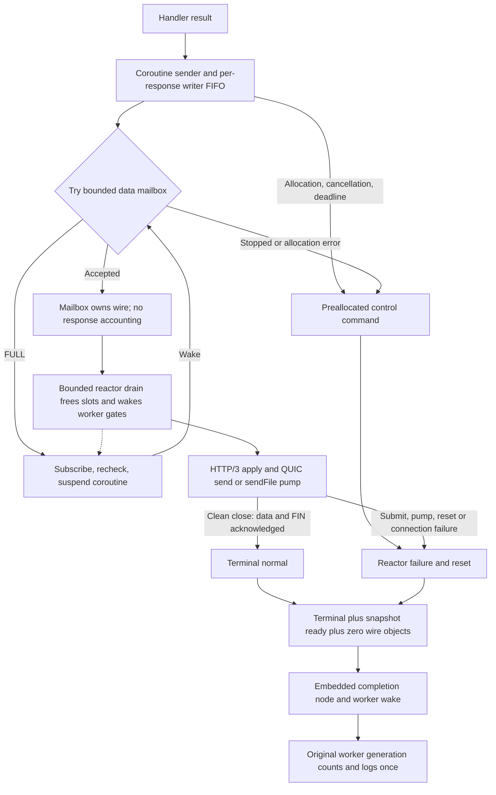

# Pooled HTTP/3 response delivery

Issue #351. Queue acceptance, HTTP/3 apply and terminal transport completion are
different events. In-thread transports retain their existing accounting paths.



## Ownership

The worker registers all capacity gates before publishing its inbox. Each
delivery record references that concrete endpoint, not a reusable registry slot.
The reactor creates the record before posting the request; the worker copies
request identity before fallible PHP object/coroutine construction.

The sender owns one wire during rendering and capacity waits. The record tracks
it across allocation bailout. Accepted enqueue clears worker ownership; a later
cancel does not return it. Wire references pin the record. Request-consumed
control may overtake data, but cannot release the stream's worker borrow while
wire objects remain. Retaining a request delays memory reclamation, not the
terminal result or logger shutdown.

The worker-only writer FIFO serializes HEADERS/CHUNK and byte-credit bookkeeping.
Finalization takes the same reentrant lock before codec finish and terminal
messages. Nonblocking refusal does not suspend; an unaccepted first commit can
be rolled back. Readiness probes wait for writer, capacity and credit with one
deadline, without reserving a writer between awaitWritable and tryWrite calls.

Stack waiters are protected through the entire registered interval, including
scheduler bailout during suspend. Cleanup unlinks them before rethrow. Active
completion removal and FIFO registration use intrusive links, not linear tail
searches or per-completion scans.

## Outcome

HTTP/3 submit chooses a status, not a successful delivery. A stream-data ACK
confirms a response has begun; clean QUIC close confirms the full send side.
These events do not prove the client's application consumed the response.
Application-body ACK callbacks accumulate the confirmed body size. A sendFile
apply starts the pump; pump failure remains a delivery failure.

The reactor chooses one outcome. Cancellation requested before that choice
excludes normal completion. Connection teardown finishes records for which
ngtcp2 emits no stream-close callback. Control callbacks run the transport flush
epilogue too: a reset does not need a later data post to reach the socket.

Publication requires the terminal outcome, the ready access snapshot and zero
wire objects. Early peer closure cannot expose an unfinished snapshot. The
worker owns all counter updates and access-log emission:

```
total_requests = responses_2xx_total + responses_3xx_total
               + responses_4xx_total + responses_5xx_total
               + responses_undelivered_total
```

No confirmed status omits http.response.status_code and reports
response_undelivered. Failure after status confirmation keeps that status and
reports response_aborted. Body size is acknowledged application-body bytes at
terminal selection (encoded bytes under compression), not prepared-buffer size.
Handler service sampling remains separate; delivery reporting can use its early
identity snapshot and reactor result even when a PHP bailout invalidates the
handler sample.

## Shutdown

Retirement unpublishes the inbox and acknowledges a reliable control admission
fence on every reactor. Full mailbox is never mistaken for a completed fence.
After the normal handler-scope drain, endpoint closure cancels remaining
deliveries, consumes completions and waits for local subscriptions to leave.
Gates are unregistered before logger/endpoint destruction.

The parent closes reload admission, sends STOP and joins the worker tasks while
its event loop continues to run. Cancelling the original wait is not worker
completion. The join uses the public `Async\protect` boundary and retains the
completion events until `pending == 0` and the current reload has released its
reservation. A partial initial submission stops and joins the accepted tasks.

The worker handler catches recoverable start bailout, then completes the clone
destructor before the task future can resolve. An arbitrary fatal/OOM inside
the destructor cannot be reported as successful quiescence; progress through
that failure is not guaranteed. Shared transport must not be freed on a false
completion acknowledgment.

Cold destructor cleanup does not suspend a PHP coroutine. It detaches stack
subscriptions, discards still worker-owned wires, then acknowledges both control
and data fences. Detached cleanup cannot touch retired gates. Reactor-owned H3
teardown is fenced after worker producers have quiesced. The old pending-wire
TTL and its potentially lost release queue are gone.

## Coverage

- h3/082: forced FULL yields to another task on the same worker; render/submit
  failures terminate the client; retained request does not delay completion.
- h3/083: counters stay zero while final ACK is delayed, then become one.
- h3/084: refused nonblocking first offer is retryable; queue deadline resets
  through control without data capacity.
- h3/085: concurrent plain/gzip writers and try/await loops stay ordered; peer
  closure before sender completion preserves the access identity.
- h3/086: bailout after waiter registration retracts subscriptions and owned
  wire; the next request still works.
- h3/087–088: repeated parent cancellation and cancellation during reload join
  workers before transport teardown; both reproduced an ASAN use-after-free
  before the parent join fix.
- core/087–088: partial initial submit and recoverable pre-start worker bailout.
- h3/089: bailout from start after inbox publication still completes cleanup.
- Existing overflow, sendFile, reload, stop and bailout tests cover integration.
